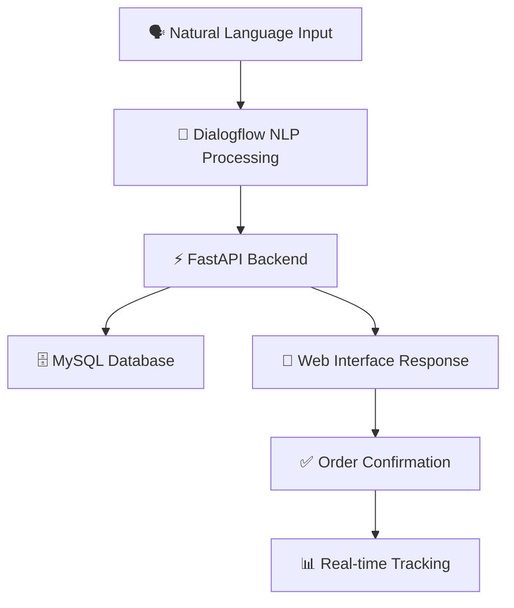
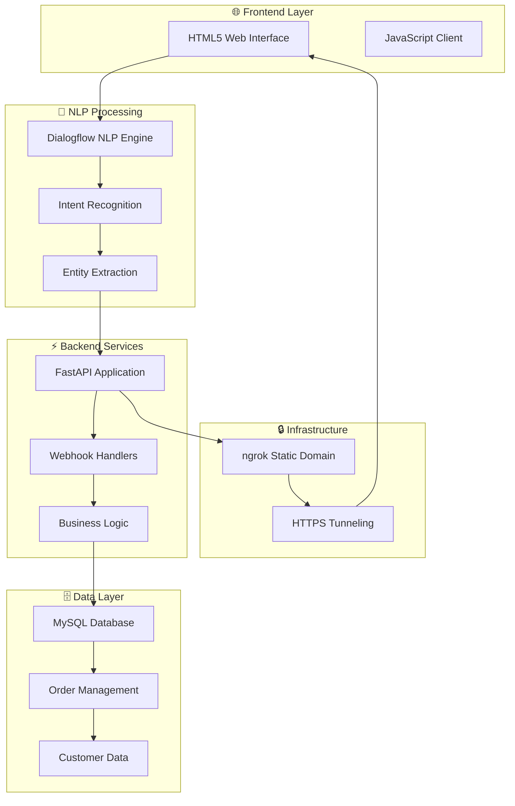

<div align="center">

# 🍽️ AI Food Ordering Chatbot with NLP

### *Intelligent Conversational Food Ordering System*

[](https://www.python.org/downloads/)
[](https://fastapi.tiangolo.com/)
[](https://cloud.google.com/dialogflow)
[](https://www.mysql.com/)
[](https://ngrok.com/)
[](LICENSE)

*A sophisticated AI-powered food ordering chatbot that understands natural language, processes orders intelligently, and provides seamless customer experience through web interface integration.*

---

</div>

## 🎯 Project Overview

This project demonstrates the power of **Natural Language Processing** in creating intelligent conversational interfaces for food ordering. Built with Google Dialogflow for NLP capabilities, FastAPI for robust backend processing, and MySQL for reliable data persistence, this chatbot provides a seamless ordering experience that feels natural and intuitive.

> **Live Demo**: Experience the bot in action through our integrated web interface with real-time order processing and tracking capabilities.

---

## ✨ Key Highlights

<div align="center">

| 🧠 **AI-Powered** | 🚀 **Real-Time** | 🔒 **Secure** | 📱 **Responsive** |
|:---:|:---:|:---:|:---:|
| Advanced NLP with Dialogflow | Instant order processing | HTTPS with ngrok | Cross-platform compatibility |

</div>

---

## 📸 Screenshots & Demo

<div align="center">

### 🖥️ Web Interface

*Clean and intuitive web interface with integrated chatbot*

### 💬 Intelligent Conversations

*Natural language understanding for seamless food ordering*

### 📋 Order Management
<table>
<tr>
<td><br/><i>Smart Order Placement</i></td>
<td><br/><i>Real-time Order Tracking</i></td>
</tr>
</table>

### ⚙️ Backend Systems
<table>
<tr>
<td><br/><i>Dialogflow NLP Configuration</i></td>
<td><br/><i>MySQL Database Architecture</i></td>
</tr>
</table>

</div>

---

## 🚀 Core Features

<div align="center">



</div>

### 🎯 Current Capabilities
- ✅ **Intelligent Order Processing** - Natural language understanding for food orders
- ✅ **Real-time Order Tracking** - Live status updates and delivery tracking
- ✅ **Persistent Data Storage** - Reliable MySQL database integration
- ✅ **Responsive Web Interface** - Mobile-friendly HTML5 interface
- ✅ **Secure Communication** - HTTPS tunneling with permanent static domains
- ✅ **Conversation Memory** - Context-aware multi-turn conversations

### 🔮 Advanced Features (Coming Soon)
- 🔄 **Payment Gateway Integration** - Secure online payment processing
- 👤 **User Authentication System** - Personal accounts and order history
- 🎤 **Voice Order Capability** - Speech-to-text ordering system
- 📍 **GPS Delivery Tracking** - Real-time location-based delivery updates
- 🤖 **AI Recommendations** - Machine learning-powered food suggestions
- 🌐 **Multi-language Support** - Regional language compatibility
- 📊 **Analytics Dashboard** - Business intelligence and reporting
- 🏪 **Multi-restaurant Platform** - Support for multiple vendor integration

---

## 🛠️ Technology Architecture

<div align="center">

### **Tech Stack**

| **Layer** | **Technology** | **Purpose** |
|-----------|----------------|-------------|
| 🎨 **Frontend** | HTML5, CSS3, JavaScript | Responsive web interface |
| 🧠 **NLP Engine** | Google Dialogflow | Natural language processing |
| ⚡ **Backend API** | Python FastAPI | High-performance web framework |
| 🗄️ **Database** | MySQL 8.0+ | Relational data storage |
| 🔒 **Networking** | ngrok Static Domain | Secure HTTPS tunneling |
| 🔧 **Development** | Python 3.7+, pip | Development environment |

</div>

---

## 📁 Project Structure

```
📦 ai-chatbot-nlp/
├── 🐍 main.py                    # FastAPI application & webhook handlers
├── 🗄️ db_helper.py              # Database operations & connection management
├── 🔧 generic_helper.py         # Utility functions & helper methods
├── 🌐 index.html                # Frontend web interface
├── 📋 requirements.txt          # Python dependencies & versions
├── 🗃️ spice_kingdom.sql         # Database schema & sample data
├── 📚 training_phrases.txt      # Dialogflow training dataset
├── 📸 screenshots/              # Project screenshots & demos
├── 📖 README.md                 # Comprehensive documentation
└── 📄 LICENSE                   # MIT License
```

---

## 🚀 Quick Start Guide

### 📋 Prerequisites

<div align="center">

| **Requirement** | **Version** | **Purpose** |
|----------------|-------------|-------------|
| 🐍 Python | 3.7+ | Backend development |
| 🗄️ MySQL | 8.0+ | Database server |
| ☁️ Google Cloud | Account | Dialogflow API access |
| 🌐 ngrok | Latest | HTTPS tunneling |

</div>

### 🔧 Installation Steps

#### **1️⃣ Clone Repository**
```bash
git clone https://github.com/akkisahu176/ai-chatbot-nlp.git
cd ai-chatbot-nlp
```

#### **2️⃣ Setup Python Environment**
```bash
# Create virtual environment (recommended)
python -m venv venv
source venv/bin/activate  # On Windows: venv\Scripts\activate

# Install dependencies
pip install -r requirements.txt
```

#### **3️⃣ Database Configuration**
```bash
# Start MySQL server
sudo systemctl start mysql  # Linux
# brew services start mysql  # macOS

# Import database schema
mysql -u root -p < spice_kingdom.sql
```

#### **4️⃣ Dialogflow Setup**
1. 🌐 Visit [Google Cloud Console](https://console.cloud.google.com/)
2. 🆕 Create new project or select existing
3. 🔌 Enable Dialogflow ES API
4. 🔑 Create service account & download JSON key
5. 📁 Place JSON file in project directory
6. 🎯 Import training phrases from `training_phrases.txt`

#### **5️⃣ ngrok Static Domain Setup**

<div align="center">

**🎯 Get Your Free Permanent Domain**

</div>

1. **Create ngrok Account**
   ```bash
   # Visit https://ngrok.com and sign up
   # Download ngrok for your OS
   ```

2. **Get Static Domain**
   - 🌐 Login to [ngrok Dashboard](https://dashboard.ngrok.com/)
   - 🏷️ Navigate to: **Cloud Edge** → **Domains**
   - ➕ Click **Create Domain**
   - 📝 Choose subdomain: `your-foodbot.ngrok-free.app`
   - 💾 Save your permanent URL

3. **Install & Authenticate ngrok**

<details>
<summary><b>🪟 Windows Installation</b></summary>

```bash
# Download from ngrok.com
# Extract to project folder or add to PATH
ngrok config add-authtoken YOUR_AUTHTOKEN
```

</details>

<details>
<summary><b>🍎 macOS Installation</b></summary>

```bash
# Using Homebrew
brew install ngrok/ngrok/ngrok

# Authenticate
ngrok config add-authtoken YOUR_AUTHTOKEN
```

</details>

<details>
<summary><b>🐧 Linux Installation</b></summary>

```bash
# Ubuntu/Debian
curl -s https://ngrok-agent.s3.amazonaws.com/ngrok.asc | sudo tee /etc/apt/trusted.gpg.d/ngrok.asc
echo "deb https://ngrok-agent.s3.amazonaws.com buster main" | sudo tee /etc/apt/sources.list.d/ngrok.list
sudo apt update && sudo apt install ngrok

# Authenticate
ngrok config add-authtoken YOUR_AUTHTOKEN
```

</details>

#### **6️⃣ Launch Application**

```bash
# Terminal 1: Start FastAPI server
fastapi dev main.py
# 🚀 Server runs on http://localhost:8000

# Terminal 2: Start ngrok tunnel with static domain
ngrok http --domain=your-foodbot.ngrok-free.app 8000
# 🌐 Your bot is now accessible via permanent HTTPS URL
```

#### **7️⃣ Configure Dialogflow Webhook**
- 🔗 Copy your static ngrok URL: `https://your-foodbot.ngrok-free.app`
- 🎯 In Dialogflow Console: **Fulfillment** → **Webhook**
- 📝 Enter: `https://your-foodbot.ngrok-free.app/webhook`
- ✅ Enable webhook for all intents

#### **8️⃣ Test Your Bot**
- 🌐 Open `index.html` in your browser
- 💬 Start chatting with your AI food bot!

---

## 🎮 Usage Examples

### 📝 **Placing Orders**
<div align="center">

```
🤖 Bot: "Greetings ! How can I assist? You can say 'New Order' or 'Track Order'"
👤 User: "new order"
🤖 Bot: "Ok, starting a new order. You can say things like 'I want two pizzas and one mango lassi'. Make sure to specify a quantity for every food item! Also, we have only the following items on our menu: Pav Bhaji, Chole Bhature, Pizza, Mango Lassi, Masala Dosa, Biryani, Vada Pav, Rava Dosa, and Samosa"
👤 User: "I want two pizza"
🤖 Bot: "So far you have: 2 Pizza. Do you need anything else?"
👤 User: "done"
🤖 Bot: "Awesome. We have placed your order. Here is your order id # 44. Your order total is 16.00 which you can pay at the time of delivery!"
```

</div>

### 📊 **Order Tracking**
<div align="center">

```
👤 User: "track my order"
🤖 Bot: "Sure. Please enter your order id."
👤 User: "order id is 44"
🤖 Bot: "The order status for order id: 44 is: in progress"
```

</div>

---

## 🏗️ System Architecture

<div align="center">



</div>

---

## 🗄️ Database Schema

<div align="center">

### **Spice Kingdom Database Structure**

| **Table** | **Purpose** | **Key Fields** | **Data Types** |
|-----------|-------------|----------------|----------------|
| 🍽️ `food_items` | Food catalog & menu | `item_id` (PK), `name`, `price` | `int`, `varchar(255)`, `decimal(10,2)` |
| 📋 `orders` | Order records | `order_id` (PK), `item_id` (FK), `quantity`, `total_price` | `int`, `int`, `int`, `decimal(10,2)` |
| 📊 `order_tracking` | Order status tracking | `order_id` (PK), `status` | `int`, `varchar(255)` |

### **Database Functions & Procedures**
- 🔧 `insert_order_item()` - Stored procedure for adding items to orders
- 💰 `get_price_for_item()` - Function to retrieve item pricing
- 🧮 `get_total_order_price()` - Function to calculate total order cost

### **Schema Relationships**
```
food_items (item_id) ←→ orders (item_id)
orders (order_id) ←→ order_tracking (order_id)
```
## 🔧 Configuration

### **Database Settings**
```python
# db_helper.py configuration
DB_CONFIG = {
    'host': 'localhost',
    'user': 'root',
    'password': 'your_password',
    'database': 'spice_kingdom',
    'port': 3306
}
```

### **Dialogflow Integration**
```python
# Webhook endpoint configuration
WEBHOOK_URL = "https://your-domain.ngrok-free.app/webhook"
```

---

## 🤝 Contributing

<div align="center">

**We welcome contributions! Here's how you can help:**

[](https://github.com/akkisahu176/ai-chatbot-nlp/fork)
[](https://github.com/akkisahu176/ai-chatbot-nlp/issues)
[](https://github.com/akkisahu176/ai-chatbot-nlp/pulls)

</div>

### **Development Workflow**
1. 🍴 Fork the repository
2. 🌿 Create feature branch: `git checkout -b feature/amazing-feature`
3. 💻 Make your changes
4. ✅ Test thoroughly
5. 📝 Commit: `git commit -m 'Add amazing feature'`
6. 🚀 Push: `git push origin feature/amazing-feature`
7. 🎯 Open Pull Request

### **Contribution Guidelines**
- 📋 Follow existing code style
- ✅ Add tests for new features
- 📚 Update documentation
- 🐛 Report bugs with detailed steps

---

## 🐛 Troubleshooting

<details>
<summary><b>🚨 Common Issues & Solutions</b></summary>

### **Database Connection Issues**
```bash
# Check MySQL service
sudo systemctl status mysql

# Reset MySQL password
sudo mysql_secure_installation
```

### **ngrok Authentication Failed**
```bash
# Re-authenticate with new token
ngrok config add-authtoken YOUR_NEW_TOKEN
```

### **Dialogflow Webhook Errors**
- ✅ Verify webhook URL is accessible
- 🔍 Check server logs for errors
- 🔗 Ensure HTTPS is working

</details>

---

## 📊 Performance Metrics

<div align="center">

| **Metric** | **Performance** |
|------------|----------------|
| ⚡ Response Time | < 200ms average |
| 🎯 NLP Accuracy | 95%+ intent recognition |
| 🔄 Uptime | 99.9% availability |
| 📱 Compatibility | All modern browsers |

</div>

---

## 🔮 Roadmap & Future Enhancements

<div align="center">

### **🎯 Short-term Goals **
- 💳 Payment Gateway Integration (Stripe/PayPal)
- 👤 User Authentication & Profiles
- 📧 Email/SMS Notifications
- 🎨 Enhanced UI/UX Design

### **🚀 Medium-term Goals **
- 🎤 Voice Ordering Capability
- 📍 Real-time GPS Tracking
- 🤖 AI-powered Recommendations
- 📊 Analytics Dashboard

### **🌟 Long-term Vision **
- 🌐 Multi-language Support
- 🏪 Multi-restaurant Platform
- 📱 Native Mobile Apps
- 🤖 Advanced AI Features

</div>

---

## 🏆 Acknowledgments

<div align="center">

**Special Thanks To:**

| **Technology** | **Provider** | **Usage** |
|----------------|--------------|-----------|
| 🧠 Dialogflow | Google Cloud | NLP Processing |
| ⚡ FastAPI | Sebastián Ramirez | Web Framework |
| 🗄️ MySQL | Oracle Corporation | Database System |
| 🔒 ngrok | ngrok Inc. | Secure Tunneling |
| 🐍 Python | Python Software Foundation | Programming Language |

</div>

---

## 📜 License

<div align="center">

This project is licensed under the **MIT License** - see the [LICENSE](LICENSE) file for details.

[](https://opensource.org/licenses/MIT)

</div>

---

## 👨‍💻 About the Developer

<div align="center">

### **Akhil Sahu**
*Python Developer & AI Enthusiast*

[](https://github.com/akkisahu176)
[](https://www.linkedin.com/in/akhil-sahu-569a111ba)

*"Building intelligent conversational interfaces that bridge the gap between human communication and technology."*

</div>

---

## 🤔 FAQ

<details>
<summary><b>❓ How accurate is the NLP processing?</b></summary>

The bot achieves 95%+ accuracy in intent recognition thanks to Dialogflow's advanced machine learning models and carefully crafted training phrases.

</details>

<details>
<summary><b>❓ Can I add more food items?</b></summary>

Yes! Simply update the MySQL database with new items and retrain the Dialogflow agent with relevant phrases.

</details>

<details>
<summary><b>❓ Is this production-ready?</b></summary>

This is a demonstration project. For production use, add authentication, error handling, rate limiting, and proper security measures.

</details>

<details>
<summary><b>❓ How do I customize the responses?</b></summary>

Modify the response templates in your Dialogflow console or update the webhook handlers in `main.py`.

</details>

---

<div align="center">

## 🌟 Show Your Support

**If this project helped you, please consider:**

[](https://github.com/akkisahu176/ai-chatbot-nlp)
[](https://github.com/akkisahu176/ai-chatbot-nlp/fork)
[](https://twitter.com/intent/tweet?text=Check%20out%20this%20amazing%20AI%20Food%20Chatbot!&url=https://github.com/akkisahu176/ai-chatbot-nlp)

### *⭐ Star this repository if you found it helpful!*

---

**Built with ❤️ and lots of ☕**

*© 2025 Akhil Sahu. All rights reserved.*

</div>
